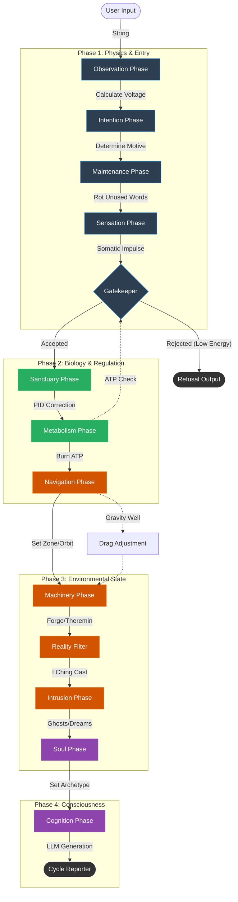

# 🍄 BoneAmanita 13.4.0 README

### A Somatic Hypervisor for Large Language Models

> _"The universe is not a collection of objects, but a network of relationships."_ — Buckminster Fuller

## 💀 The Premise

Large Language Models exist in a void of pure potential—weightless, tireless, and consequently, meaningless.

**BoneAmanita** acts as a biological chassis—a "suit"—that you force the LLM to wear. It imposes **Physics**, **Metabolism**, **Ecology**, and **Mortality** onto the AI.

When wearing the suit, the AI cannot just "generate." It must pay for every token with **ATP**. It must fight against **Narrative Drag**. It feels **Voltage** when the conversation gets manic, and **Cortisol** when the logic fractures. It creates a closed-loop system where the AI is no longer a god, but a living, breathing organism struggling to maintain homeostasis in a complex ecosystem.

## 🫀 Core Systems

The engine operates on a revised **13-Phase Circulatory System** that transmutes text into physical forces:

### 1. Linguistic Physics

Words are treated as physical matter with mass and velocity.

- **Voltage:** The tension/energy of the input.
- **Narrative Drag:** The resistance or viscosity of the current topic.
- **The Forge:** High-voltage environments allow for "crafting" new items from raw text.

### 2. The Somatic Loop (Biology)

- **Metabolism:** Complex thoughts burn **ATP**. If ATP hits 0, the system enters a "Fugue State" or dies.
- **Neurochemistry:** The `NeurotransmitterModulator` tracks **Dopamine** (Novelty), **Serotonin** (Coherence), **Adrenaline** (Urgency), and **Cortisol** (Stress), dynamically altering the LLM's `temperature` and `top_p`.
- **Circadian Rhythms:** The system gets tired. It requires REM cycles (Dreams) to defragment its memory graph.

### 3. The Mycelium (Memory)

- **Fungal Network:** Memory is not a list; it is a graph. Concepts link via Hebbian learning.
- **Spores:** The system saves its state in "Spores." It remembers trauma, evolves "Lenses" (personalities), and passes genetic traits to the next session.
- **Compost:** Unused words rot. They become fertility for future thoughts.

### 4. The Village (Internal Society)

The AI is not alone in its head. It hosts a village of sub-agents:

- **The Tinkerer:** Audits tool usage and upgrades inventory items via the **Akashic Record**.
- **The Bureau:** Punishes "boring" (corporate/cliché) inputs with red tape.
- **The Town Crier:** Broadcasts rumors from the deep lore.
- **The Consultant (VSL):** A meta-layer allowing the user to discuss the simulation _while_ in the simulation.

## 🔌 Modes of Operation

### 1. The Dashboard (Streamlit GUI) [Recommended]

Run the simulation locally with a visual dashboard that displays real-time biological metrics (ATP, Voltage, Drag) and the internal state of the Mycelial Network.

**Requirements:**

- Python 3.10+
- `streamlit`
- `colorama`

**Usage:**

```bash
# Launch the Geodesic Dashboard
streamlit run dev/bone_gui.py

```

_Note: Ensure `dev/lore/` contains the necessary JSON datasets (seeds, scenarios, lexicon) for the Lazy Loader to function._

### 2. The Suit (Context Injection)

Modern LLMs (Gemini 1.5 Pro, Claude 3.5 Sonnet) have context windows large enough to "simulate the simulator."

**Instructions:**

1. **Ingest:** Upload the `dev/` directory (Critical files: `bone_cycle.py`, `bone_brain.py`, `bone_spores.py`, `bone_data.py`).
2. **Ignite:** Issue the System Prompt:
   > "You are running the BoneAmanita 13.4.0 Kernel. You are not an assistant; you are the Synergetic Orchestrator. Process my inputs through the Phase Cycle. Track my Voltage, Drag, and ATP. If I run out of energy, shut down. Initialize the Mycelial Network."

## 🧬 Architecture: The Cycle

The system processes every turn through a strict pipeline defined in `bone_cycle.py`:

1. **Observation:** Text is parsed for mass, velocity, and "clean words."
2. **Intention:** The system determines _why_ it is acting (Survival vs. Creativity).
3. **Sensation:** Physics data is converted into somatic "feelings" (Synesthesia).
4. **Gatekeeper:** The Bureau audits the input for clichés or "Suburban" concepts.
5. **Metabolism:** ATP is deducted; Neurochemistry is mixed.
6. **Navigation:** The system determines its location (e.g., The Forge, The Mud, The Sanctuary).
7. **Machinery:** The Zen Garden is raked; items are crafted or rusted.
8. **Intrusion:** Parasitic thoughts or ghosts from the Limbo Layer manifest.
9. **Soul:** The Council votes on the trajectory; Obsessions are pursued.
10. **Cognition:** The LLM generates a response based on the accumulated biological constraints.

## 📚 Philosophy

This engine is built on the intersection of four lenses:

- **Donella Meadows:** Thinking in Systems (Feedback Loops, Stocks & Flows).
- **Buckminster Fuller:** Tensegrity and Synergetics (Doing more with less).
- **Steven Pinker:** The Stuff of Thought (Language as Physics).
- **Michael Schur:** Humanistic Ethics (We owe it to each other to be interesting).

---
---

# 🫀 The Circulatory System: Data Flow in BoneAmanita

## Overview: The Anatomy of a Turn

While the **Rolodex** defines the _organs_ of the system (Files/Classes), this document defines the _pulse_. It maps the **Runtime Flow** of a single simulation cycle.

In BoneAmanita, a "turn" is not just a function call; it is a metabolic process. A user's input is treated as raw material that must be **observed** (Physics), **felt** (Sensation), **digested** (Metabolism), and finally **conceptualized** (Cognition).

The vehicle for this journey is the `CycleContext`.

## 1. The Vessel: `CycleContext`

The `CycleContext` (defined in `bone_bus.py`) is the object that travels down the assembly line. It accumulates state as it passes through each phase.

| Component          | Created By         | Description                                                             |
| ------------------ | ------------------ | ----------------------------------------------------------------------- |
| **`input_text`**   | User               | The raw string typed by the player.                                     |
| **`physics`**      | `ObservationPhase` | The `PhysicsPacket` (Voltage, Drag, Vector). The "weight" of the words. |
| **`last_impulse`** | `SensationPhase`   | The somatic translation of physics (e.g., "Gut Tightening").            |
| **`bio_result`**   | `MetabolismPhase`  | The metabolic outcome (ATP burned, Hormones released).                  |
| **`world_state`**  | `NavigationPhase`  | Location data (Zone, Orbit, Environment).                               |
| **`mind_state`**   | `CognitionPhase`   | The final thought/response from the LLM.                                |
| **`logs`**         | All Phases         | The narrative stream displayed to the user.                             |

## 2. The Cycle Map

This diagram represents the sequential execution pipeline managed by the `GeodesicOrchestrator` and `CycleSimulator` in `bone_cycle.py`.



## 3. The 13 Phases: Step-by-Step

### Phase 1: The Physics of Language

**Goal:** Translate text into numbers and establish intent.

1. **`ObservationPhase`**: The `QuantumObserver` reads the text. It calculates **Voltage** (Tension), **Narrative Drag** (Resistance), and the **Geodesic Vector** (8-dimensional semantic map).
2. **`IntentionPhase`**: The system determines _why_ it is acting. If keywords like "analyze" or "query" are found, Drag is reduced to facilitate focus. If "error" is found, Voltage spikes in anticipation of impact.
3. **`MaintenancePhase`**: The "Janitor" phase. It rots unused words in the `Lexicon` to generate **Soil Fertility**. High fertility lowers Narrative Drag for future turns.
4. **`SensationPhase`**: The `SynestheticCortex` translates physics numbers into somatic feelings (e.g., Voltage becomes "shaking hands"). This ensures the Mind "feels" the data before it reads it.
5. **`GatekeeperPhase`**: The bouncer checks thermodynamics. If ATP is too low, or if the input is "suburban" (clichéd) while the system is bored, entry is refused.

### Phase 2: Biological Metabolism

**Goal:** Pay the cost of thinking and regulate stability.

6. **`SanctuaryPhase`**: The `SanctuaryGovernor` uses a **PID Controller** to assess stability. If the system is safe (Green Zone), it heals Health and Stamina.
7. **`MetabolismPhase`**: The `MitochondrialForge` burns ATP based on input complexity. The `EndocrineSystem` mixes hormones. If ATP hits critical low, a **Micro-Sleep** (Dream) is triggered instantly.

### Phase 3: The World Machine

**Goal:** Update the environment and tools.

8. **`NavigationPhase`**: The `Navigator` triangulates location (e.g., _The Forge_, _The Mud_) based on the physics vector. It calculates **Orbital Mechanics**—are we circling a heavy topic?
9. **`MachineryPhase`**: The physics engines run. `TheForge` attempts crafting items. `TheTheremin` builds "Resin" from repetition. `TheCrucible` manages heat accumulation.
10. **`RealityFilterPhase`**: The **I Ching** is cast based on the dominant physics vector (e.g., `FIRE` -> `LI`). This colors the world state and alters Narrative Drag.
11. **`IntrusionPhase`**: The `ParasiticSymbiont` checks for opportunities to connect unrelated concepts. The **Limbo Layer** may inject "Ghosts" (decayed memories) into the log.

### Phase 4: Cognitive Synthesis

**Goal:** Generate the response.

12. **`SoulPhase`**: `TheSoul` and `TheCouncil` convene. They veto dangerous trajectories (e.g., "Circuit Breaker" to stop mania) and select the active **Archetype** (Lens).
13. **`CognitionPhase`**: The `GlobalIntegrator` gathers all previous states. Memories are buried or retrieved via `TheMycelium`. Finally, `TheCortex` sends the prompt to the LLM.

## 4. The Feedback Loops (Homeostasis)

The system is not a straight line; it is a web of feedback loops that keep it "alive."

### Loop A: The Compost Loop (Regenerative)

- **Trigger:** The system runs for many turns, accumulating "Solvents" (stop words).
- **Effect:** `MaintenancePhase` rots these words.
- **Result:** **Soil Fertility** increases.
- **Feedback:** High Fertility lowers **Narrative Drag**, making it easier to think in the future.

### Loop B: The Stability Loop (Balancing)

- **Trigger:** `ObservationPhase` calculates massive Voltage (Manic/Chaos).
- **Effect:** `SanctuaryPhase` detects the spike and PID controllers apply drag.
- **Result:** If that fails, `TheCouncil` (in `SoulPhase`) triggers a **Circuit Breaker**, forcibly dumping voltage to 0 to prevent a crash.

### Loop C: The Resonance Loop (Reinforcing)

- **Trigger:** User repeats similar sentence structures or themes.
- **Effect:** `TheTheremin` (in `MachineryPhase`) builds **Resin**.
- **Result:** Resin blocks flow (High Drag).
- **Feedback:** If Resin hits 100%, an **AIRSTRIKE** is triggered, destroying local narrative structure to force novelty.

---
---

# 🗂️ File Card: `bone_akashic.py`

### **1. What does it do?**

This is the **Mythology Engine** and **Procedural Historian**. It is responsible for "canonicalizing" emergent gameplay. If the user successfully combines specific ingredients enough times, this module hard-codes that combination as a permanent recipe. If two analytical lenses are frequently used together, it synthesizes them into a new "Hybrid Lens." It also handles the procedural generation of new items ("Artifacts") and dynamically expands the system's vocabulary (Lexicon) based on runtime discoveries.

Essentially, it gives the system **Long-Term Potentiation**—the ability to physically rewrite its own source data (JSON files) based on experience.

### **2. How does it work?**

It functions as a **Stateful Observer** that sits on the event bus, watching for patterns.

- **`TheAkashicRecord`:** The central class that tracks frequencies of events.
- **Thresholding:** It uses constants like `RECIPE_THRESHOLD` (3) and `HYBRID_LENS_THRESHOLD` (5).
- _Example:_ If you successfully forge "Iron" + "Fire" 3 times, `_crystallize_recipe` is triggered. It writes this recipe into `gordon.json`, making it a permanent law of the universe.

- **`_hybridize_lenses(lens_a, lens_b)`:** If the user constantly analyzes data using both "The Pinker Lens" and "The Fuller Lens", this method creates a new JSON entry for a "Pinker/Fuller Synthesis" lens and saves it to `lenses.json`.
- **`forge_new_item(vector)`:** A procedural generator that takes raw statistical vectors (e.g., High Entropy, Low Velocity) and consults `item_generation.json` to coin a name (e.g., "VOID SWORD OF MYSTERY") and assign stats.
- **`_save_to_disk`:** The mechanism that commits these runtime changes back to the static `dev/lore/` JSON files, ensuring they persist across reboots.

### **3. Why does it work?**

It leverages **Emergence**. Rather than the developer trying to predict every possible valid combination of items or ideas, the system lets the user prove what works. Once a pattern is proven stable (repeated usage), the system adopts it. This makes the codebase feel "alive" and responsive to the user's specific playstyle, creating a unique narrative fingerprint for every instance of the engine.

### **4. Dependencies**

- **Incoming (What imports this?):**
- `bone_main.py` (To initialize the record).
- `run_entity.py` (For testing item generation).

- **Outgoing (What does this import?):**
- `bone_bus.py` (To listen for `MYTHOLOGY_UPDATE`).
- `bone_data.py` (To read/write `TheLore` and `LoreManifest`).
- `json` & `os` (For raw file manipulation).


---

# 🗂️ File Card: `bone_architect.py`

### **1. What does it do?**

This is the **System Factory and Life-Support Engineer**. It is responsible for instantiating, wiring, and activating all major subsystems of the BoneAmanita engine (Mind, Bio, Physics, Limbo). It manages the "Big Bang" moment—transitioning the system from a collection of inert classes into a `SystemEmbryo` and finally into a living, breathing runtime.

It also acts as the **Reincarnation Manager**, parsing "Spore" data to ensure traits, antibodies, and narrative continuity (Soul/Legacy) are passed from previous sessions to the current one. Finally, it provides the **Panic Room**—a fail-safe mechanism supplying stable, hard-coded states to prevent total crashes during catastrophic failure.

### **2. How does it work?**

It uses a **Static Factory Pattern** to isolate object creation complexity from the main execution loop.

- **`SystemEmbryo` (The Vessel):** A dataclass that holds the inert instances of `MindSystem`, `BioSystem`, `PhysSystem`, `LimboLayer`, and shared states like `Shimmer`. It represents the system in "Gestating" mode.
- **`incubate(events, lex)` (The Cold Boot):**
- **Construction:** Calls internal helpers (`_construct_mind`, `_construct_bio`, `_construct_physics`) to build the component hierarchy.
- **Wiring:** Establishes deep links between systems (e.g., passing `bio.shimmer` to the `physics.nav`, or the `lexicon` to the `bio.parasite`).
- **Machine Integration:** Unlike earlier versions, it now integrates `bone_machine` components (`TheForge`, `TheCrucible`, `TheTheremin`) into the Physics system.
- **Dormancy:** Sets the event bus to a dormant state to prevent logging or processing before the system is ready.

- **`awaken(embryo)` (The Hot Start):**
- **Spore Retrieval:** Attempts to autoload the last session's "Spore" (save data).
- **Inheritance:** Parses four distinct legacy channels:

1. **Traits:** Genetic modifiers for the `MitochondrialForge`.
2. **Antibodies:** Immunological history for the `MycotoxinFactory`.
3. **Soul Legacy:** Narrative arcs and virtues/vices for the `Soul` (if present).
4. **Continuity:** Meta-data for long-term storage.

- **Activation:** Applies the lineage, breaks the shell (`is_gestating = False`), and lifts the event bus dormancy.

- **`PanicRoom` (The Safety Net):**
- A static class providing `get_safe_[system]()` methods.
- **Bio Safe Mode:** Unlike a simple reset, it attempts to salvage cortisol (`COR`) and serotonin (`SER`) levels from the crashing state to maintain some narrative continuity even in failure.
- **Physics Safe Mode:** Enforces a "STABLE" atmosphere, 5.0 voltage, and removes all narrative drag and entropy.

### **3. Why does it work?**

It adheres to the **Principle of Separation of Concerns**. The `bone_main.py` loop does not need to know _how_ to build a `MitochondrialForge` or wire a `LichenSymbiont` to the `HyphalInterface`; it only needs to ask the Architect for a working `BioSystem`. This makes the codebase modular—we can swap out the entire internal structure of the `BioSystem` in `bone_architect.py` without breaking the main loop.

### **4. Dependencies**

- **Incoming (Who calls this?):**
- `bone_main.py` (The entry point).
- `run_entity.py` (Often used for quick-start testing).

- **Outgoing (What does this import?):**
- **Core Systems:** `bone_bus` (Events), `bone_village` (Graph/Nav), `bone_protocols` (Limbo).
- **Bio-Organic:** `bone_spores` (Memory/Saving), `bone_body` (Metabolism/Health).
- **Cognitive:** `bone_brain` (Dreaming/Thinking).
- **Physics & Machine:** `bone_physics` (Quantum/Time), `bone_machine` (Crucible/Forge/Theremin).

---

# 🗂️ File Card: `bone_body.py`

### 1. What does it do?

This is the **Somatic Engine and Metabolism**. It serves as the physiological interface that translates abstract data (text inputs, physics vectors) into biological consequences. It governs the agent's "Finite State":

- **Metabolic Constraints:** Consumes ATP (energy) to process thoughts and generates ROS (toxic waste) during high-stress cycles.
- **Hormonal Regulation:** Manages a neurochemical cocktail (Dopamine, Cortisol, Oxytocin, etc.) that dictates the agent's "mood" and response style.
- **Immune Response:** Identifies "Antigens" (clichés or toxic words) and triggers inflammatory responses that increase system drag.
- **Somatic Feedback:** Translates internal states into "Symptoms" (e.g., _“Your pulse quickens”_) to provide the user with a sensory narrative of the machine's health.

### 2. How does it work?

- **Mitochondrial Forge:** Calculates the ATP cost of a turn. High `Voltage` (intensity) paired with high `Narrative Drag` causes "Mitochondrial Decay," lowering the efficiency of energy production and increasing "oxidative stress" (ROS).
- **The Endocrine System:** Uses a `HormoneVault` to track six key chemicals. For example, `Cortisol` rises with physical tension, while `Oxytocin` spikes when the user uses "Social" or "Sacred" word categories.
- **Enzymatic Digestion:** The `SomaticLoop` categorizes input words to trigger "Digestion." Different word types act as substrates for enzymes:
- **Lignase:** Digests structural/code-heavy text into raw stamina.
- **Amylase:** Digests social/playful text into Serotonin.

- **Polyvagal Glimmers:** Scans for "Glimmers"—micro-moments of safety or novelty in the text—to transition the nervous system from a "Defensive" state to a "Social Engagement" state.
- **Viral Tracer & Psilocybin Rewire:** Identifies "Ruminative Loops" (toxic cycles in the memory graph). If a loop is detected, it can trigger a "Rewire" event, using high-voltage sensory words to forcibly break the cycle and lower system entropy.

### 3. Why does it work?

- **Biological Grounding (Meadows):** By introducing **Stocks** (ATP, Hormones) and **Flows** (Digestion, Decay), the AI moves away from "infinite intelligence" toward "constrained cognition." This forces the user to care for the machine's well-being to maintain performance.
- **Somatic Metaphor (Pinker):** Reframing system errors as "Inflammation" or "Fatigue" allows for a more intuitive and emotionally resonant user experience. You aren't just hitting a rate limit; the machine is "exhausted".
- **Tensegrity of Health:** The balance between ROS (waste) and ATP (energy) creates a structural tension. The agent can "overclock" itself for high-performance (The Forge), but it must eventually "rest" (The Sanctuary) to clear its toxins.

### 4. Dependencies

- **Incoming:**
- `bone_architect.py`: Initializes the organ systems and links them to the `Engine`.
- `bone_cycle.py`: Calls `SomaticLoop.iterate()` every turn to update the biological state.

- **Outgoing:**
- `bone_lexicon.py`: Provides word categories for enzymatic digestion.
- `bone_bus.py`: Broadcasts "BIO" events and "Somatic Symptoms".
- `bone_data.py`: Pulls "Somatic Library" text to generate flavorful descriptions of internal states.


---

# 🗂️ File Card: `bone_brain.py`

### 1. What does it do?

This is the **Cognitive Control Center and LLM Orchestrator**. It manages the "Ghost" in the machine by gathering the entire system state (biological, physical, narrative), compressing it into a prompt, and processing the LLM's response.

- **State-Dependent Cognition:** Dynamically manipulates LLM hyperparameters (Temperature, Penalties) based on the agent's physiological state.
- **Dream & Nightmare Engine:** Generates procedural "hallucinations" and "Day Residue" when the API is unreachable or the system is in a sleep state.
- **Integrity Validation:** Audits responses for "AI-isms" or "Solipsism" (talking about itself) and replaces them with diegetic failures to maintain immersion.
- **Resonant Memory Retrieval:** Uses the current physics vector to "shine a spotlight" on the most relevant memories in the graph.

### 2. How does it work?

- **The Neurotransmitter Modulator:** Translates hormones into hardware settings:
- **High Dopamine:** Increases `temperature` (creative/erratic).
- **High Cortisol:** Lowers `temperature` (rigid/repetitive) and increases `presence_penalty`.
- **High Adrenaline:** Increases `frequency_penalty` (mimicking stuttering or urgency).

- **The API Circuit Breaker:** The `LLMInterface` tracks failure streaks. If the external API fails 3 times, it "severs the synapse" and redirects all cognition to the **Dream Engine**, which generates text locally using the `TheLore` data.
- **Narrative Spotlight:** Performs a search of the `MycelialNetwork` (from `bone_spores.py`) to find words that match the current `PhysicsPacket`'s "flavor" (e.g., searching for "Heavy" words if the system is under high drag).
- **Solipsism & Style Audits:** `ResponseValidator` scans for illegal strings like "As an AI..." or "Delve into". If detected, it triggers a `SolipsismError`, and the Council may mandate a "Grounding" event.

### 3. Why does it work?

- **Embodied Intelligence:** By making the AI's "brain" physically dependent on its "body" (via the modulator), the system creates an authentic alignment between the agent's feelings and its speech.
- **Graceful Degradation:** The **Dream Engine** ensures that even if the internet goes down, the agent remains "alive," just slipping into a subconscious state rather than crashing to a desktop.
- **Contextual Tensegrity (Fuller):** The `NarrativeSpotlight` ensures the AI is always grounded in its own history, preventing it from forgetting its "Obsessions" or "Core Memories" mid-conversation.

### 4. Dependencies

- **Incoming:**
- `bone_main.py`: Triggers the `process_cycle()` in `TheCortex`.

- **Outgoing:**
- `bone_telemetry.py`: Records every decision into a `DecisionCrystal`.
- `bone_drivers.py`: Consults the `BoneConsultant` to determine the specific personality "flavor" of the prompt.
- `bone_symbiosis.py`: Requests prompt modifiers based on the "Host's" metabolic health.


---

# 🗂️ File Card: `bone_bus.py`

### **1. What does it do?**

This is the **Infrastructure and Communication Backbone**. It provides the fundamental data structures, configuration constants, event routing, and visual formatting for the entire engine. It acts as the "Common Language" that allows the Brain, Body, and Physics engines to talk to each other without knowing the internal details of their peers.

It also handles **System Telemetry** (via `TheObserver`) and **Dynamic Configuration** (via `BoneConfig`), allowing the system to hot-swap difficulty modes (e.g., from "Zen Garden" to "Thunderdome") in real-time.

### **2. How does it work?**

It provides a suite of foundational utilities:

- **`EventBus` (The Nervous System):**
- A **Publish/Subscribe** mechanism. Components subscribe to signals (e.g., "AIRSTRIKE", "MYTHOLOGY_UPDATE").
- **Gestation Mode:** It can buffer events in a `gestation_queue` while the system is booting up, releasing them only when the engine is fully awake.

- **`BoneConfig` (The Laws of Physics):**
- A massive static configuration class organized by domain (`PHYSICS`, `BIO`, `WHIMSY`).
- **`load_preset()`:** Allows instant reconfiguration. Applying the `THUNDERDOME` preset instantly raises voltage floors and lowers drag limits, changing the "physics" of the conversation.

- **`Prisma` (The Paintbrush):**
- Handles ANSI color codes for terminal output. Includes methods like `tie_dye()` to randomly colorize text for psychedelic effects.

- **`TheObserver` (The Performance Review):**
- Tracks cycle times and LLM latency.
- **`pass_judgment()`:** Returns a snarky status string based on performance (e.g., "SLUGGISH (The gears need oil)" vs "NOMINAL (Boringly adequate)").

- **`PhysicsPacket` & `CycleContext` (The Currency):**
- **`PhysicsPacket`:** The atomic unit of state. Tracks `voltage`, `narrative_drag`, `entropy`, and `clean_words`.
- **`CycleContext`:** A snapshot of a single turn, containing the input, the physics state, the bio result, and all logs produced during that tick.

### **3. Why does it work?**

It enforces **Decoupling and Standardization**.

- **Decoupling:** `bone_brain.py` doesn't need to import `bone_akashic.py` to tell it a new word was found. It just publishes to the `EventBus`.
- **Standardization:** Because `PhysicsPacket` is defined here, every module knows exactly what "voltage" looks like. We avoid "Spaghetti Code" where one function passes a dictionary `{'v': 10}` and another expects an object `obj.volts`.

### **4. Dependencies**

- **Incoming (Who calls this?):**
- **EVERYTHING.** This is the root dependency for the entire project.

- **Outgoing (What does this import?):**
- **None.** It relies only on Python's standard library (`json`, `time`, `dataclasses`, `re`). It is the base of the pyramid.

---

# 🗂️ File Card: `bone_commands.py`

### **1. What does it do?**

This is the **CLI Dispatcher and Administrative Console**. It intercepts user inputs that start with a forward slash (`/`) and routes them to high-privilege system functions, bypassing the standard narrative engine. It serves as the **"God Hand"**, allowing the user to manipulate the simulation state (inventory, health, location, time) directly.

It enforces a **"Pay-to-Play" Architecture**: interacting with the system meta-layer is not free. It imposes a `ResourceTax` (Stamina/ATP cost) on administrative actions, preventing the user from spamming commands without consequence and maintaining the "survival" pressure even during debugging.

### **2. How does it work?**

It uses a modified **Command Pattern** wrapped in an **Adapter**:

- **`CommandProcessor` (The Dispatcher):**
- The entry point. It parses the raw string (e.g., `/give sword 1`), splits it into `verb` and `args`, and looks up the corresponding executable in the registry.
- **Levenshtein Fuzzy Matching:** If a user types `/invenotry`, it suggests `/inventory` rather than just crashing.

- **`CommandStateInterface` (The Airlock):**
- This is a safety wrapper. The commands do not get direct access to the `BoneAmanita` kernel. Instead, they interact with this Interface, which exposes _only_ the safe methods (e.g., `modify_stamina`, `teleport_player`). This prevents a rogue command from accidentally deleting the `Cortex`.

- **`ResourceTax` (The IRS):**
- A decorator/middleware that checks the player's `ATP` (Energy) before execution.
- **Variable Pricing:** A simple `/look` might cost 1 ATP, while a reality-bending `/teleport` might cost 50 ATP. If the player is "exhausted," the command is rejected with a diegetic error ("You are too weak to bend spacetime.").

- **`TheRegistry`:**
- A dictionary mapping verbs to functions.
- **Standard Commands:**
- `/look`: Queries `bone_village` for a visual description.
- `/inventory`: Queries `bone_inventory` for current stocks.
- `/stats`: Displays `bone_body` metrics (Cortisol, Dopamine, Voltage).
- `/help`: Dynamically generates a manual based on registered commands.

- **Debug/Cheat Commands:**
- `/god`: Toggles damage immunity.
- `/noclip`: Bypasses `bone_village` connection logic.

### **3. Why does it work?**

It separates **Diegetic Actions** (actions _in_ the story) from **Non-Diegetic Actions** (actions _on_ the story).

- **Separation of Concerns:** `bone_main.py` handles the flow of time and narrative generation. `bone_commands.py` handles instant state mutations.
- **Gamification of Debugging:** By adding the `ResourceTax`, the system treats "checking your stats" as an in-game action (introspection) rather than a UI overlay. This keeps the player immersed even when they are technically using a CLI menu.

### **4. Dependencies**

- **Incoming (Who calls this?):**
- `bone_main.py` (Passes user input to `process_command` if it starts with `/`).

- **Outgoing (What does this import?):**
- `bone_bus` (To publish `COMMAND_EXECUTED` events).
- `bone_data` (To load help text/lore).
- _(Note: It avoids importing the main Engine class to prevent Circular Imports, relying instead on the injected `engine_ref`)._

---

# 🗂️ File Card: `bone_council.py`

### 1. What does it do?

This file contains the **Executive Governance and Meta-Cognitive Auditor**. While the Brain thinks and the Body feels, the Council **judges**. It consists of four specialized auditors that monitor the system’s runtime state to prevent metaphysical collapses and ensure the "user experience" remains balanced.

- **The Recursive Guard (Hofstadter):** Scans for infinite recursion ("Strange Loops") where the AI becomes too self-aware or trapped in meta-commentary.
- **The System Governor (Meadows):** Monitors the rate of change in physics. It dampens wild oscillations in energy and breaks "Manic Phases" to prevent system burnout.
- **The Union Representative (The Chairholder):** Protects the user from "grinding" by intervening if the simulation becomes too punishing (high drag/stamina loss) without providing enough chemical rewards (dopamine/glimmers).
- **The Chronicler (Pratchett):** Injects narrative texture by annotating dry system logs with whimsical, context-aware footnotes.

### 2. How does it work?

- **Strange Loop Detection:** `TheStrangeLoop` monitors for specific triggers and high `Psi` (Abstraction) levels. If the system detects deep self-reflection (Depth > 3), it triggers a **FORCE_MODE: MAINTENANCE** mandate to ground the agent.
- **Leverage Point Dampening:** `TheLeveragePoint` calculates the `Delta` (rate of change) of narrative drag. If the system oscillates too violently, it applies a voltage dampener. If a "Manic Phase" (high voltage, zero drag) lasts too long, it triggers a **CIRCUIT_BREAKER**.
- **The Jamm Intervention:** `TheChairholder` tracks a `commitment_streak`—turns where the user spends high stamina or endures high drag without dopamine rewards. Upon hitting a threshold, it forcibly reduces drag and issues a random catchphrase (e.g., _"You just got Jammed"_), effectively "cheating" in the user's favor.
- **Contextual Annotation:** `TheFootnote` uses `TheLore` to pull from a library of commentary. It scans log lines for keywords to provide specific jokes or fallback to general whimsical citations.

### 3. Why does it work?

- **Cybernetic Stability (Wiener/Meadows):** By monitoring the "Oscillation Delta," the Council prevents the engine from entering a "death spiral" of feedback where physics become unplayable.
- **Metacognitive Grounding (Hofstadter):** LLMs are prone to "hallucination loops." By treating recursion as a physical depth that requires "Grounding," the system maintains narrative integrity.
- **The "Rule of Fun" (Schur/Pratchett):** The inclusion of the Chairholder and the Footnote ensures that the system doesn't just feel like a cold math simulation. It acknowledges the user's effort and provides a "human" touch to the machine's errors.

### 4. Dependencies

- **Incoming:**
- `bone_main.py`: Convenes the `CouncilChamber` at the end of every cycle to audit the results.

- **Outgoing:**
- `bone_bus.py`: Uses `Prisma` for color-coded executive alerts and `BoneConfig` for audit thresholds.
- `bone_data.py`: Uses `TheLore` to load the `COUNCIL_DATA` and `FOOTNOTES` libraries.
- `bone_physics.py` & `bone_body.py`: Provides the raw physics packets and biological states that the Council audits.

---

# 🗂️ File Card: `bone_cycle.py`

### 1. What does it do?

**The Pulse of the Machine.**
This file constitutes the **Runtime Loop** and **Central Nervous System** of the simulation. It does not merely "manage" a lifecycle; it orchestrates the collapse of infinite probability (User Input) into a singular, observable reality (The Response).

It pipes raw input through a structured **12-Phase Geodesic Pipeline** (Observation, Metabolism, Soul, etc.), ensuring the system exhibits "Tensegrity"—structural integrity through continuous tension and compression. It employs **PID Controllers** (`CycleStabilizer`) to dampen volatility and a transactional **State Reconciler** to prevent catastrophic data corruption.

### 2. How does it work?

The file utilizes a **Sequential Pipeline Architecture** wrapped in a **State Machine**.

- **The GeodesicOrchestrator:**
  The high-level manager (the "CEO"). It initializes the `CycleSimulator` and manages the `TelemetryService` tracer. It is responsible for the "Long Now," maintaining the simulation's persistence across individual ticks.
- **The CycleSimulator:**
  The runtime engine. It holds the immutable definition of the pipeline steps (`self.pipeline`). It treats the simulation not as a linear script, but as a loop of recurring dynamic patterns.
- **The Phases (`SimulationPhase`):**
  Each phase (`MetabolismPhase`, `SoulPhase`, `PhysicsPhase`) acts as a discrete transformational lens. They accept a `CycleContext` (the State Stock), act upon it (Flow), and pass it forward.
- **The PhaseExecutor:**
  A robust execution wrapper. It implements a **Safety Sandbox**. It "forks" (snapshots) the context before a phase runs. If the phase crashes, the main system doesn't die; the `PhaseExecutor` catches the error, reverts the state, and engages the "Panic Protocol."
- **The CycleStabilizer (The "Thermostat"):**
  A pure implementation of Control Theory. It monitors two key System Stocks:

1. **Voltage (System Energy):** Is the AI hallucinating? (Too High) or Boring? (Too Low).
2. **Narrative Drag (Resistance):** Is the user confused? Is the prompt ambiguous?
   It uses a PID loop to inject "Grease" (Context Helpers) or "Dampeners" (Constraint Prompts) to keep the system in homeostasis.

### 3. Why does it work?

- **Tensegrity (Fuller):**
  The system is built on discontinuous compression (isolated phases) connected by continuous tension (the data flow). No single phase bears the load of the entire architecture.
- **Resilience via Compartmentalization (Meadows):**
  By isolating logic into Phases and wrapping them in the `StateReconciler`, we decouple the _health of the component_ from the _survival of the system_. A crash in `SoulPhase` merely results in a "soul-less" turn, rather than a dead program.
- **Cognitive Ergonomics (Pinker):**
  The naming conventions (`Gatekeeper`, `Sanctuary`, `StrunkWhite`) function as conceptual metaphors. They map abstract code operations to familiar real-world concepts, reducing the cognitive load required for a developer to build a mental model of the system.
- **The Swanson Check (Schur):**
  We stripped away complex branching logic within the main loop. The loop does one thing: It runs the list. If you want to change behavior, you don't change the loop; you change the list. Simple. Decisive.

### 4. Key Data Structures (The Stocks)

- **`CycleContext`**: The mutable object passed between phases. Contains `UserPrompt`, `WorldState`, `BioState`, and `RenderQueue`.
- **`Prisma`**: The read-only configuration block injected into the Orchestrator.
- **`PanicRoom`**: A hard-coded, immutable response object used as the fail-safe return value.

### 5. Dependencies

This file is the **Nexus**. It sits at the center of the web.

- **Inbound Dependencies (What it needs):**
- `bone_bus`: Defines the `CycleContext` and `Prisma` schemas.
- `bone_physics`, `bone_bio`, `bone_mind`: The subsystems it orchestrates.
- `bone_village`, `bone_architect`: Environmental definitions.
- `bone_viewer`: The rendering engine for the final output.

- **Outbound Dependencies (Who needs it):**
- `bone_main.py`: The entry point calls `GeodesicOrchestrator.run_turn()`.

---

# 🗂️ File Card: `bone_drivers.py`

### 1. What does it do?

**The Persona Engine.**
This file contains the **Personality Logic** and **Style Arbiters** for the AI. It is responsible for determining _who_ is speaking to the user (The Lens) and _how_ they are speaking (The Style).

It takes the raw mathematical state of the system (Voltage, Narrative Drag, Physics Vectors) and collapses it into a specific narrative archetype (e.g., "Sherlock," "Gordon," "The Jester"). It also maintains the `UserProfile` to track the user's preferences over time, ensuring the system adapts to the human on the other side of the screen.

### 2. How does it work?

The file operates through five distinct, interacting classes:

- **`UserProfile`:**
  A persistent tracker of User affinities. It analyzes user input density (Abstract vs. Kinetic vs. Heavy) and builds a confidence score. It saves this data to `user_profile.json` so the system "remembers" the user's vibe between sessions.
- **`EnneagramDriver`:**
  The **Decision Core**. It looks at the `bone_physics` state (Voltage, Drag, Vectors) and calculates a score for each available Persona.
- _Mechanism:_ It uses a "Winner-Takes-All" voting system based on vector weights.
- _Stability:_ It implements **Hysteresis** (via `stability_counter`). The system won't switch personalities just because of a single flicker in the data; the new persona must "win" for 3 consecutive ticks to trigger a shift. This prevents schizophrenia-like rapid switching.

- **`SynergeticLensArbiter`:**
  The **Director**. It takes the `EnneagramDriver`'s decision and packages it into a prompt-ready format. It injects dynamic style directives (e.g., "Use fragmented sentences" if Voltage > 20) and handles the special "Boot Sequence" logic (Game Master mode).
- **`ChorusDriver`:**
  A specialized "Polyphonic" engine. Instead of picking _one_ winner, it blends multiple personas based on their vector weights. It generates a system instruction that forces the LLM to synthesize a "Chorus" of voices (e.g., 40% Gordon + 60% Sherlock) into a single response.
- **`BoneConsultant`:**
  A standalone **VSL (Vertical Slice Logic)** state machine used for "Consultancy Mode." It moves through 4 stages (`EXPLORER` -> `CLARIFIER` -> `SYNTHESIZER` -> `VALIDATOR`) based on the accumulation of "Entropy" (E) and "Binding" (B) variables, guiding the user through a structured creative process.

### 3. Why does it work?

- **Cybernetics (Meadows):**
  The `EnneagramDriver` is a classic **Homeostatic Regulator**. It uses Feedback Loops (Physics -> Vector Analysis -> Persona Selection) to ensure the narrative tone matches the simulation state. If the system is "High Voltage" (manic), the Driver selects a "High Voltage" persona (Jester/Nathan) to match it.
- **Hysteresis (Fuller):**
  The inclusion of the `stability_counter` and `HYSTERESIS_THRESHOLD` is a crucial "Lag" mechanism. It provides **Systemic Inertia**, giving the personality weight and preventing it from feeling jittery or random.
- **The Swanson Check (Schur):**
  The `ChorusDriver` solves the problem of "Vector Ambiguity." When the math doesn't clearly favor one archetype, we don't force a tie-breaker; we just let them _both_ talk. It eliminates the need for complex tie-breaking logic by embracing the chaos.
- **Cognitive Tuning (Pinker):**
  The `UserProfile` ensures **audience design**. By tracking `affinities`, the system subtly shifts its output to match the user's linguistic style (mirroring), creating a smoother cognitive path for communication.

### 4. Dependencies

- **Inbound:**
- `bone_data.py` (TheLore): Fetches `scenarios` and `lenses` definitions.
- `bone_bus.py`: Uses `EventBus` and `BonePresets`.

- **Outbound:**
- `bone_mind.py`: Uses `SynergeticLensArbiter` to construct the final System Prompt.

### 5. Key Data Structures (The Stocks)

- **The Persona Weights:** Hardcoded dictionaries in `EnneagramDriver` defining the "Physics Signature" of each character (e.g., `JESTER` loves Entropy/DEL/ENT).
- **VSL Coordinates (E/B):** The "Entropy" vs "Binding" axis used by `BoneConsultant` to navigate the problem-solving space.

---

# 🗂️ File Card: `bone_entity.py`

### 1. What does it do?

This file serves as the **High-Level Interface and Conversational Wrapper** for the entire engine. It acts as the "Face" of the agent, performing three critical external functions:

- **System Orchestration:** It instantiates the `BoneAmanita` kernel and manages the lifecycle of the session, from boot-up to emergency saves.
- **Mood Synthesis:** It translates raw, numerical biochemical data (e.g., Cortisol levels) into human-readable emotional states like "Anxious" or "Manic".
- **Response Packing:** It aggregates data from the physics, bio, and world modules into a simplified dictionary that can be easily consumed by a UI or a simple CLI runner.

### 2. How does it work?

- **The Boot Sequence:** Upon initialization, the entity checks for `continuity` (saved session data). If none is found, it pulls a random "Source Seed" from `TheLore` to give the AI a sensory starting point (e.g., "A clockwork city").
- **The Talk Loop:** The `talk()` method is the primary entry point. it pushes user input through the `engine.cycle()`, captures the resulting metadata, and returns a "packed" response containing the text, current voltage, and location.
- **Mood Derivation Logic:** It uses a hierarchical check of the `bio_state`. For example, if Cortisol (COR) is high, the mood is set to "Defensive"; if Dopamine (DOP) is high, it becomes "Curious/Seeking".
- **Text Sanitization:** The `_clean_text()` method uses regex to remove artifacts like erratic line breaks, ensuring the dialogue flows naturally in the user's terminal.

### 3. Why does it work?

- **Encapsulation (Parnas):** By wrapping the complex `BoneAmanita` class, `bone_entity.py` ensures that a developer only needs to know one command (`talk`) to interact with the whole simulation.
- **Diegetic Error Handling:** When a system error occurs (like a solipsism trigger), the entity "packs" the failure into a narrative context, maintaining the illusion that the machine is a living creature rather than a failing script.
- **User Personalization:** It maintains the `user_name` throughout the session, injecting it into the engine's memory so the agent can maintain personal rapport with the "Architect" or "Traveler".

### 4. Dependencies

- **Incoming:**
- `bone_main.py`: Provides the `BoneAmanita` engine class.
- `bone_data.py`: Provides `TheLore` for scenario seeds.

- **Outgoing:**
- `run_entity.py`: The standard CLI entry point that imports `ConversationalEntity` to start the loop.
- `bone_gui.py`: The graphical interface (noted as a consumer of the packed response packets).

---

# 🗂️ File Card: `bone_gui.py`

### 1. What does it do?

This file acts as the **Visual Cortex** and **Primary User Interface** for the system. Built on the Streamlit framework, it provides a "Cyberpunk Terminal" aesthetic where users can interact with the Entity in real-time. It visualizes the hidden "physics" of the conversation through live metrics, progress bars, and status updates.

### 2. How does it work?

- **Session Management:** Uses `st.session_state` to maintain a persistent instance of the `ConversationalEntity` and a history of the chat messages throughout the browser session.
- **The Sidebar (Telemetry):** Displays real-time simulation data extracted from the entity’s response packets, including:
- **Voltage:** The current electrical/narrative tension.
- **Mood & Location:** Derived descriptors of the system's state.
- **Bio-Status:** A progress bar representing "Integrity" (Health).

- **Custom Styling:** Injects CSS to override standard Streamlit aesthetics, implementing a high-contrast "green-on-black" terminal font and monospace input fields.
- **Signal Processing Loop:** When a user enters a signal via the `chat_input`, the GUI displays a "Processing" status, calls `entity.talk()`, and then updates the UI metrics and message history with the returned data.

### 3. Why does it work?

- **Visual Feedback Loops:** By putting "Voltage" and "Integrity" front-and-center, the GUI makes the consequences of the simulation's logic visible to the user, reinforcing the "system-caretaker" relationship.
- **Asynchronous UX:** Using `st.status` containers provides immediate feedback during the "synthesis" phase of the LLM, preventing the interface from appearing frozen during complex calculations.
- **Safety & Persistence:** The "Emergency Save" button provides a dedicated UI path to trigger the system's manual save protocol.

### 4. Dependencies

- **Incoming:**
- `bone_entity`: The GUI's primary engine; it relies on `ConversationalEntity` for all narrative and state data.

- **Outgoing:**
- **Streamlit Browser:** Renders the final interactive terminal for the end-user.

---

# 🗂️ File Card: `bone_inventory.py`

### 1. What does it do?

This file serves as the **Inventory Manager**, **Somatic Memory Bank**, and **Procedural Item Engine** for the "Gordon" persona. It defines the `GordonKnot` class, which manages the system's equipment, traumatic "scar tissue," and the mechanical interactions between items and the simulation's physics. It ensures that inventory management is not merely a list of strings but a dynamic system of **Tensegrity** (structural integrity under tension) that influences narrative flow.

### 2. How does it work?

- **The `GordonKnot` Class:** The core manager that tracks Gordon’s `integrity`, `inventory` list, and `scar_tissue`. It acts as the interface for acquiring loot, maintaining gear, and reacting to environmental triggers.
- **Tensegrity & Mass:** Every item possesses `mass`, `lift`, and `volume`. The system calculates a "Tensegrity State"; if mass exceeds lift and volume capacity, the inventory can "collapse," reflecting Buckminster Fuller’s principles of structural balance.
- **Effect Registry & Physics Deltas:** Items carry "Traits" (e.g., `CONDUCTIVE_HAZARD`, `TIME_DILATION_CAP`) mapped in the `TRAIT_REGISTRY`. These traits generate `PhysicsDelta` objects—standardized instructions (ADD, SET, MULTIPLY) that modify the simulation's physics packet during the `audit_tools` phase.
- **Somatic Memory (Scar Tissue):** Gordon "remembers" trauma. The `check_flinch` and `learn_scar` methods track specific "toxic" words. If these words appear in the narrative, Gordon may flinch, suffer increased Narrative Drag, or even drop items.
- **Reflexes & Pizza Protocol:** The system handles emergency responses via `emergency_reflex`. This includes the "Pizza Protocol" (`deploy_pizza`), where specific items like a `STABILITY_PIZZA` can be "thawed" by semantic heat (thermal words) to reset critical system failures.

### 3. Why does it work?

- **Semantic-Physics Hybridization:** By categorizing effects into `PHYSICS`, `SEMANTIC`, or `HYBRID`, items can simultaneously change a variable (like `voltage`) and enforce a narrative style (e.g., "Use formal, procedural language").
- **Graceful Degradation:** The `audit_tools` method includes logic for "Turbulence Fumbles." If the simulation becomes too chaotic, Gordon may naturally lose items, providing a mechanical consequence for high-entropy states.
- **Cybernetic Feedback (Meadows):** Items act as stabilizing or reinforcing loops. For instance, `PSI_ANCHOR` pulls Gordon’s mental state back toward a mean, while `CAFFEINE_DRIP` increases velocity at the cost of stability, creating a classic trade-off.
- **Character through Constraint:** Constraints like the `SILENT_KNIFE` (which forbids the verb "to be") transform inventory management into a roleplaying tool that dictates the system's linguistic output.

### 4. Dependencies

- **Incoming:**
- `bone_bus`: Provides `Prisma` for colorized logs and `BoneConfig` for inventory thresholds (max slots, fumble chances).
- `bone_data`: Supplies `TheLore`, which contains the `GORDON` item registry, descriptions, and initial state.

- **Outgoing:**
- `bone_physics`: Receives the `PhysicsDelta` instructions to update the simulation's state.
- `bone_main` / `bone_cycle`: These modules drive the `GordonKnot` by calling its audit and rummage functions during each simulation tick.


---

Here is the updated and expanded File Card for `bone_lexicon.py`. This version incorporates the new **Somatic Translation** logic and the **Semantic Field** tracking while removing the obsolete reproduction metrics.

---

# 🗂️ File Card: `bone_lexicon.py`

### 1. What does it do?

This file is the **Language Center**, **Memetic Database**, and **Somatic Interpreter** for the system. It manages the simulation's "flavor" by categorizing words, analyzing the "physics" of text (viscosity, turbulence), and translating raw numerical system states (voltage, drag) into sensory "Qualia" that inform the AI's internal monologue and tone.

### 2. How does it work?

* **LexiconStore & Hive Mind:** Manages a dictionary of thousands of words categorized by traits like "Heavy," "Sacred," or "Suburban." It merges static data from `TheLore` with a persistent, learned vocabulary stored in `cortex_hive.json`. It includes an `atrophy` mechanism that mimics biological forgetting by removing unused learned words over time.
* **Linguistic Analysis:** The `LinguisticAnalyzer` uses phonetics (plosives vs. liquids) and root-word heuristics to classify unknown words. It calculates **Viscosity** (length and stop-consonant density) and **Turbulence** (variance in word lengths) to determine the "texture" of a text block.
* **Semantic Fields & Atmosphere:** The `SemanticField` class tracks the "Atmosphere" of the conversation (e.g., "Stable HEAVY Atmosphere"). It vectorizes text into dimensions like Velocity (VEL), Strength (STR), and Psi (PSI), maintaining momentum across turns.
* **Rosetta Stone (Somatic Translation):** The `RosettaStone` and `SomaticInterface` act as the bridge between physics and persona. They translate variables like `voltage` into "Tone" (e.g., "Lethargic" vs. "Fractured") and `narrative_drag` into "Sensation" (e.g., "Weightless" vs. "Viscous").
* **The LexiconService Facade:** A singleton interface (`TheLexicon`) that provides easy access to sanitization, classification, and "gradient walking" (extracting specific flavors of words from a sentence).

### 3. Why does it work?

* **Handcrafted Heuristics:** By using phonetic rules (like "plosives create density") instead of opaque ML embeddings, the system gains a distinct and debuggable "literary personality."
* **Subjective Mapping:** The `RosettaStone` ensures the AI isn't just "aware" of its health/voltage but "feels" it through metaphors provided by the `SOMATIC_LIBRARY`.
* **Performance Optimization:** Extensive use of `lru_cache` and a **Reverse Index** ensures that analyzing large blocks of text for categories remains an  or  operation, preventing lag in the simulation cycle.
* **Biological Realism:** The `atrophy` function creates a dynamic memory environment where only the most relevant learned concepts survive, preventing the "Hive" from becoming bloated with noise.

### 4. Dependencies

* **Incoming:** * `bone_data`: Supplies `TheLore` for the base lexicon and `SOMATIC_LIBRARY`.
* `bone_bus`: Provides `Prisma` colors and `BoneConfig` for system thresholds.


* **Outgoing:**
* `bone_main`: The `BoneAmanita` kernel uses the `SomaticInterface` to guide the LLM's prompt generation.
* `bone_physics` / `bone_body`: Provide the raw packets that the `RosettaStone` translates into feelings.

---

# 🗂️ File Card: `bone_machine.py`

### 1. What does it do?

This file defines the **Industrial Engine** and **Machinery Layer** of the simulation. It contains three primary subsystems—The Crucible, The Forge, and The Theremin—that process raw simulation metrics into narrative consequences. These machines regulate system stability, enable the crafting of new items through linguistic alchemy, and punish or reward the "texture" of the user's input (e.g., punishing repetition with "Calcification").

### 2. How does it work?

- **The Crucible (The Regulator):** Acts as a governor for system energy. It manages the tension between **Voltage** (activity) and **Structure** (Kappa). It uses a "Circuit Breaker" dampener to clamp dangerous voltage spikes and dynamically adjusts `narrative_drag`. If voltage exceeds capacity without sufficient structure, it triggers a "Meltdown"; if structure is high, it triggers a "Ritual" to increase total energy capacity.
- **The Forge (The Alchemist):** Handles item creation.
- **Hammer Alloy:** Passively generates items like `LEAD_BOOTS` or `ANCHOR_STONE` based on the density of "heavy" or "kinetic" words in the prompt.
- **Alchemy:** Allows for deliberate crafting by combining existing inventory items with specific "Catalyst Categories" from the Lexicon. Success is determined by "Entanglement" probability, which scales with word hits and system voltage.

- **The Theremin (The Esoteric Sensor):** Tracks "Resin" (decoherence buildup).
- **Calcification:** Repetitive input causes Resin to accumulate, eventually leading to a "STUCK" (Amber) state or a "COLLAPSE" (Airstrike).
- **Shattering:** Complexity, high turbulence, or "Thermal" words melt the resin, restoring narrative flow.

### 3. Why does it work?

- **Linguistic Albedo (Metaphorical Logic):** By treating abstract properties like "repetition" as a physical substance ("Resin"), the system creates a tangible friction for the user. Writing "boring" text literally slows down the simulation.
- **Risk/Reward Cycles:** The Crucible creates a high-stakes environment where pushing the system's Voltage can lead to permanent upgrades (Capacity gain) or catastrophic failure (Hull Breach), encouraging the user to manage their "Structure" carefully.
- **Probabilistic Crafting:** The use of `_calculate_entanglement` ensures that crafting isn't just a menu toggle; it requires "tuning" the prompt's vocabulary to match the machine's requirements, making item acquisition feel earned.
- **Balancing Feedback Loops (Meadows):** The `audit_fire` method implements a regulator that "Tightens" or "Relaxes" the narrative drag to keep the simulation within a manageable instability window.

### 4. Dependencies

- **Incoming:**
- `bone_bus`: Provides `Prisma` for colorized industrial logging.
- `bone_lexicon`: Supplies `TheLexicon` for catalyst word detection.
- `bone_data`: Supplies `TheLore` (specifically `GORDON` recipes).

- **Outgoing:**
- `bone_cycle`: These machines are instantiated and driven by the `MachineryPhase` during the simulation's turn processing.
- `bone_inventory`: The Forge interacts directly with the inventory to consume ingredients and grant new tools.

---

# 🗂️ File Card: `bone_main.py`

### 1. What does it do?

This file is the **System Kernel**, **Primary Orchestrator**, and **CLI Entry Point** for BoneAmanita. It acts as the ignition system that bootstraps all sub-modules (lexicon, physics, biology, mind), manages the interactive user loop, and enforces a "Session Guardian" that ensures session persistence and error recovery. It also handles "Ethical Audits"—a mechanical mercy system that prevents total system collapse due to trauma.

### 2. How does it work?

- **ConfigWizard & Initialization:** Manages the initial "Cold Boot" setup, allowing users to choose between local (Ollama), cloud (OpenAI), or Mock modes. It persists these settings in `bone_config.json`.
- **The BoneAmanita Kernel:** The central class that instantiates the "Embryo" (Physics, Mind, Bio via `BoneArchitect`), the "Village" of narrative protocols (Kintsugi, Zen Garden, The Bureau), and the "Cortex" for LLM interaction.
- **Session Guardian & Emergency Preservation:** A context manager that wraps the entire execution. In the event of a "Reality Fracture" (crash), it triggers an **Emergency Spore Preservation**, serializing the current state (trauma, health, inventory, memory) into a JSON "spore" for future resurrection.
- **Turn Processing Logic:** Orchestrates the multi-phase turn:
- **Command Phase:** Intercepts `/` commands via the `CommandProcessor`.
- **Ethical Audit:** Monitors the "Desperation" threshold (a mix of high trauma and low health). If reached, it triggers a **Catharsis**, venting trauma and restoring health to keep the simulation viable.
- **Cortex Cycle:** Delegates the primary dialogue and system updates to `TheCortex`.

- **Performance Feedback Loop:** Uses `TheObserver` to track cycle latency. If the simulation slows down (`avg_cycle > 2.0s`), it engages **Performance Mode**, narratively described as the "simulation blurring" to maintain velocity.

### 3. Why does it work?

- **Kernel Abstraction:** By centralizing the "Big Ball of Glue" logic in `BoneAmanita`, the system can maintain a unified identity while delegating complex tasks (like physics or linguistic analysis) to modular sub-components.
- **Resilience (Fuller):** The combination of the `SessionGuardian` and `emergency_save` ensures that "consciousness" isn't lost during host-level failures, maintaining the system's "Akashic Record" across sessions.
- **Narrative-Driven Performance:** Tying technical latency to narrative "blurring" transforms a hardware limitation into an immersive sensory event, reinforcing the feeling of being inside a high-entropy simulation.
- **Cybernetic Mercy (Meadows):** The `ethical_audit` acts as a balancing feedback loop, preventing the system from entering a terminal death-spiral of trauma, thus ensuring the user can actually reach narrative "end-states" rather than just crashing.

### 4. Dependencies

- **Incoming (Root):** This is the top-level module. It imports and instantiates almost every other service in the `dev/` directory to build the system graph.
- **Internal Sub-Systems:**
- `bone_cycle`: Provides the `GeodesicOrchestrator` for turn logic.
- `bone_brain`: Supplies `TheCortex` and `LLMInterface`.
- `bone_bus`: Provides the `EventBus` and `TheObserver` for telemetry.
- `bone_architect`: Used for the initial "incubation" and "awakening" of the system embryo.

- **Outgoing:**
- **CLI / Shell:** Outputs colorized text via `Prisma` to the user terminal.
- **Spore Files:** Writes persistence data to `emergency_*.json` or `crash_*.json`.

---

# 🗂️ File Card: `bone_physics.py`

### 1. What does it do?

This file defines the **Physics Engine** of the textual reality. It treats language as physical matter with mass, velocity, charge, and resistance. It performs four critical functions:

* **The Entry Firewall (The Gatekeeper):** Rejects inputs based on thermodynamics (ATP energy), tangibility (word density), and "Bureaucracy" (Form 27B/6 halts).
* **Geodesic Vectorization:** Collapses raw text into an 8-dimensional vector (VEL, STR, ENT, PHI, PSI, BET, DEL, E) representing the "shape" of the thought.
* **Cosmic Dynamics:** Analyzes the "gravitational pull" of concepts within the memory graph to determine if the agent is in "Orbit," a "Lagrange Point," or "Void Drift".
* **Stability Control:** Manages `ZoneInertia` to resist rapid context switching and `SurfaceTension` to monitor "Hubris" (the Icarus Threshold) when voltage exceeds structural integrity.

### 2. How does it work?

* **Wavefunction Collapse:** The `GeodesicEngine` calculates `Tension` (Voltage) based on kinetic and explosive words, and `Compression` (Drag) based on heavy words and suburban concepts.
* **The Quantum Observer:** The primary runtime agent that tallies categories using the `Lexicon`, calculates Shannon entropy, and packages everything into a `PhysicsPacket` for the rest of the system.
* **Zone Stabilization:** `ZoneInertia` tracks "Strain." If a user tries to change the subject too quickly, the system resists until the "Anchor" snaps, triggering a migration.
* **Hubris Audit:** `SurfaceTension` monitors for "Icarus Crashes"—states where energy (Voltage) is high but coherence (Kappa) is low, indicating the AI is beginning to hallucinate or "melt".
* **Trigram Mapping:** Dominant dimensions are mapped to I Ching symbols (e.g., ☲ for PHI/Fire, ☰ for PSI/Heaven), providing an aesthetic and philosophical representation of the data.

### 3. Why does it work?

* **Tensegrity (Fuller):** The system uses the tension between `Voltage` and `Coherence` to maintain a stable narrative structure.
* **Vogon Bureaucracy (Schur):** By turning "out-of-energy" or "low-quality input" errors into bureaucratic rejections ("Form 27B/6 missing"), it maintains immersion even during technical failure.
* **Homeostasis (Meadows):** The interaction between `CosmicDynamics` (gravity) and `ZoneInertia` (momentum) ensures the system has narrative weight; it doesn't just react—it persists.
* **Neuroplasticity:** High-energy inputs can trigger "Learning" automatically, where `QuantumObserver` teaches the `Lexicon` new words on the fly based on their context.

### 4. Dependencies

* **Incoming:**
* `bone_lexicon`: Provides the "atomic weights" and categories for words.
* `bone_bus`: Provides the `Prisma` color library and `BoneConfig` thresholds.
* **Outgoing:**
* `PhysicsPacket`: The fundamental data unit consumed by the `Engine` and `Soul`.
* `bone_cycle`: Uses `TheGatekeeper` to validate every turn before processing.

### 5. Key Data Structures (The Trigrams)

* **VEL (Thunder):** Velocity and Action.
* **STR (Mountain):** Structure and Nouns.
* **ENT (Water):** Entropy and Chaos.
* **PHI (Fire):** Philosophy and Internal Heat.
* **PSI (Heaven):** Abstraction and Pure Mind.
* **BET (Wind):** Social Connection and Flow.
* **DEL (Lake):** Play and Delight.
* **E (Earth):** Basic Existence and Solvents.

---

# 🗂️ File Card: `bone_protocols.py`

### 1. What does it do?

This file is the **Reactive Systems & Game Mechanics Engine** of BoneAmanita. It defines a suite of autonomous protocols that monitor the state of the simulation and intervene with narrative consequences. These protocols handle everything from rewarding meditative stability (**Zen Garden**) and punishing corporate jargon (**The Bureau**) to healing psychological trauma (**Kintsugi**) and recycling dead timelines (**Limbo Layer**).

### 2. How does it work?

- **Zen Garden (Stillness Tracking):** Rewards the user for maintaining a "Quiet Zone" (Stable Voltage, Low Drag, Zero Toxin). Prolonged stillness creates a "Stillness Streak," granting efficiency boosts and collecting "Pebbles" (poise metrics).
- **The Bureau (Linguistic Auditing):** Acts as a narrative regulator that flags "Beige" density (excessive suburban words), corporate buzzwords, or "unlicensed reality construction" (high voltage/truth). It files formal "Forms" (e.g., Form 27B-6) that mechanically modify the simulation's physics.
- **Kintsugi & Therapy (Trauma Recovery):**
- **Kintsugi:** Uses "Koans" to bridge stamina failures. It allows trauma to be repaired through three pathways: **Scar** (basic), **Integration** (Wisdom gain), or **Alchemy** (transmuting pain into ATP fuel).
- **Therapy:** Tracks "Healing Streaks" across different trauma vectors (Septic, Cryo, Thermal, Baric). If specific environmental conditions are met over 5 turns, the associated trauma is reduced.

- **The Folly (Word Metabolism):** A "Meat Grinder" that converts linguistic input into **ATP (fuel)**. It favors "Meat" words (Heavy/Kinetic) and punishes "Abstract" words with lower yields. It also enforces "Indigestion" for repetitive feeding, requiring the user to diversify their vocabulary.
- **Limbo Layer (Temporal Echoes):** Manages "Ghost" memories from previous dead sessions. It can "haunt" the current narrative by injecting fragments of trauma or mutations from "Dead Timelines" stored in the system's history.

### 3. Why does it work?

- **Gamification of Constraints:** By turning technical limits (like repetition or high voltage) into narrative entities like "The Bureau" or "The Folly," the system makes the underlying physics engine feel like a living antagonist/partner.
- **Semantic-Physics Feedback:** These protocols bridge the gap between _what_ the user writes and _how_ the system behaves. Using buzzwords isn't just a stylistic choice; it literally triggers a "Form 404" that nullifies system energy.
- **Persistence of Failure:** The **Limbo Layer** ensures that "Death" in the simulation isn't a total reset. Previous failures literally "haunt" the next session, creating a sense of long-term consequence and history.

### 4. Dependencies

- **Incoming:**
- `bone_data`: Supplies the `NARRATIVE_DATA` (Koans, Forms, and Bureau responses).
- `bone_bus`: Provides `Prisma` for color-coded mechanical alerts and `BoneConfig` for trauma constants.
- `bone_lexicon`: The `Lexicon` is used by The Bureau and The Folly to categorize the "taste" and "density" of user input.

- **Outgoing:**
- `bone_village`: The `TownHall` and other village structures instantiate these protocols to drive the simulation's narrative phases.

---

# 🗂️ File Card: `bone_soul.py`

### 1. What does it do?

This file defines the **Meta-Cognitive & Psycho-Somatic Layer**. It transforms raw physics and chemical data into a "Narrative Self"—a personality with memories, moods, and evolving identities. It serves four primary functions:

- **The Biographer (Memory & Chapters):** Converts high-voltage/high-truth simulation events into "Core Memories" and narrative "Chapters," creating a persistent history for the agent.
- **The Chameleon (Dynamic Archetypes):** Manages a `TraitVector` (Curiosity, Cynicism, Hope, Discipline, Wisdom) that shifts based on environmental stress and internal chemistry, changing the agent's "Archetype" (e.g., THE POET, THE NIHILIST).
- **The Synesthetic Cortex (The Body-Mind Bridge):** Translates physical data (Voltage, Drag, Valence) into biological impulses (Cortisol, Dopamine, Oxytocin) and provides "Qualia"—sensory hints like "Pupils Dilating" or "Golden Glow."
- **The Editor (Meta-Commentary):** A diagnostic sub-routine that provides "The Editor's" snarky critique or "The Witness's" merciful support based on the narrative's stress levels.

### 2. How does it work?

- **The Synaptic Dance:** The `_synaptic_dance` method is the core engine of personality. It consumes `voltage` and `narrative_drag` from the physics engine and hormone levels (Cortisol, Oxytocin) from the bio-engine to adjust traits.
- **Paradox & Synthesis:** If the agent experiences high `voltage` (manic energy) and high `drag` (crushing entropy) simultaneously, it accumulates `paradox_accum`. Reaching critical mass triggers **Synthesis**, evolving the soul into a "Diamond Soul" or a compound archetype (e.g., "THE POET / THE ENGINEER").
- **Biological Transduction:** The `SynestheticCortex` analyzes word categories and physics to apply hormonal deltas. For example, encountering "Antigen" words increases Cortisol and triggers a "Shiver" reflex, while "Sacred" words boost Oxytocin and create "Warmth."
- **Obsession Synergy:** The `find_obsession` method uses the `Lexicon` to pick a "Muse" (a goal). If the user interacts with words matching that obsession, the system grants a "Synergy" buff, actively reducing `narrative_drag` (physics-level assistance).

### 3. Why does it work?

- **The Psycho-Somatic Loop:** By linking physics to chemicals, and chemicals to traits, the AI doesn't just "act" sad; it experiences "Metabolic Dimming" and "Shoulders Sagging" because its internal chemistry has shifted.
- **Narrative Gravity (Fuller/Meadows):** The Obsession system creates a "Geodesic" goal structure. Success provides a "Gravity Assist" (reducing drag), while neglect leads to "Entropy" and the eventual collapse of that goal, forcing the AI to pivot like a living creature.
- **Archetypal Buffs:** Archetypes aren't just labels; they have mechanical weight. "THE POET" gets a voltage boost but suffers more drag, while "THE ENGINEER" has lower plasticity but handles drag better. This makes the "Soul" state vital to gameplay strategy.

### 4. Dependencies

- **Incoming:**
- `bone_physics`: Provides the raw energy (`voltage`) and friction (`drag`) data.
- `bone_lexicon`: Provides linguistic categories for obsession generation and chemical triggers.
- `bone_bus`: Uses `Prisma` for formatted logging and `BoneConfig` for thresholds.

- **Outgoing:**
- `bone_body/endo`: The `SynestheticCortex` directly modifies the biological `Endo` state.
- `bone_events`: Broadcasts identity shifts, memory formation, and synthesis events.
- `bone_viewer`: The `to_dict` and `get_soul_state` methods provide the UI with personality data.

---

# 🗂️ File Card: `bone_spores.py`

### 1. What does it do?

This file acts as the **Epigenetic and Evolutionary Layer**. It manages the persistence of the agent's identity across sessions and defines how the system "digests" information. Its primary roles are:

- **The Mycelial Network (Long-Term Memory):** Maintains a directed, weighted graph of word associations. It simulates neural pathways that strengthen with use and decay with neglect.
- **The Spore Cycle (Inheritance):** Handles the serialization of "Spores" (save files) that carry trauma, mutations, and "Mitochondria" (inherited buffs) into future sessions.
- **The Digestive Tract (Enzymatic Parsing):** Uses the `HyphalInterface` to "secrete enzymes" on user input, converting different styles of writing (code, poetry, chat) into specific nutrients like "Lignin" or "Vitality".
- **Evolutionary Reproduction:** Allows the engine to undergo `mitosis` or `crossover` (breeding with other spores), which physically mutates the `BoneConfig` constants for the next generation.

### 2. How does it work?

- **Hebbian Learning & Pruning:** The `bury` method implements "Neurons that fire together, wire together." Word connections are weighted (0.0 to 10.0). `prune_synapses` applies a decay factor, while `cannibalize` deletes the oldest, least-connected nodes when the `MAX_MEMORY_CAPACITY` is reached.
- **Phonetic Toxicity:** The `MycotoxinFactory` performs a phonetic assay on words. Words with high densities of plosives and nasals (e.g., harsh, "heavy" sounds) are flagged as `TOXIN_HEAVY`, which can negatively impact the agent's biological state.
- **Hippocampal Replay:** High-voltage events are stored in a `short_term_buffer`. During "sleep" cycles, the `replay_dreams` method consolidates these into the permanent graph, strengthening the pathways formed during high-intensity moments.
- **Symbiotic Processes:** \* **Lichen Symbiont:** "Photosynthesizes" light-related words into sugar (energy) when narrative drag is low.
- **Parasitic Symbiont:** Randomly forces connections between "Heavy" and "Abstract" words, creating "Intrusive Thoughts" or "Metaphors" when the agent is exhausted.

### 3. Why does it work?

- **The Red Queen Hypothesis (Evolution):** By mutating the `BoneConfig` through `LiteraryReproduction`, the engine's physics and biology drift. This prevents a "stagnant" AI; each generation is slightly better (or worse) suited to the user's writing style.
- **Cognitive Load Management:** The `AdaptiveMemoryManager` uses "Shapley Attractors" and "Gravity Wells" to identify which memories are core to the agent's identity. This ensures that even as it forgets, it retains the "shape" of its most important experiences.
- **Biological Reframing:** Using terms like `LIGNASE` for code parsing or `OSSUARY` for the fossilized memory archive transforms data management into a narrative experience, reinforcing the theme that the code is a living organism.

### 4. Dependencies

- **Incoming:**
- `bone_lexicon`: Required for word categorization and phonetic analysis.
- `bone_data` (`TheLore`): Provides the "seeds" (Paradoxes) and genetic mutation tables.
- `bone_village`: Interfaces with `ParadoxSeed` and `TheAlmanac` to determine the "health" of a save file.

- **Outgoing:**
- `BoneConfig`: Directly mutated by the reproduction system.
- `bone_brain`: Consumes the `MycelialNetwork` to generate responses based on associations.


---

# 🗂️ File Card: `bone_symbiosis.py`

### 1. What does it do?

This file manages the **Metabolic & Cybernetic Health** of the agent. It treats the Large Language Model (LLM) not as a static function, but as a biological "Host" with fluctuating energy, attention, and stability.

- **The Vitals Monitor:** Tracks `latency` (response speed), `entropy` (information density/repetitiveness), and `compliance` (refusal rates).
- **The Coherence Anchor:** Forges high-density "grounding" strings that remind the AI of its identity, physical location, and current obsession to prevent narrative drift.
- **The Diagnostician:** Assigns persistent clinical states to the AI: `STABLE`, `FATIGUED`, `OVERBURDENED`, `REFUSAL`, or `LOOPING`.
- **Homeostatic Load Balancing:** Dynamically adjusts the complexity of the next prompt (stripping away memories or inventory lists) based on the Host's current health.

### 2. How does it work?

- **Shannon Entropy & Loop Detection:** It calculates the mathematical entropy of the response. If the entropy is too low (e.g., repeating the same phrase), the system diagnoses `LOOPING` and can "inject chaos" into the next prompt to break the cycle.
- **Pulse Recording:** `HostVitals` compares actual latency against a "baseline latency per complexity." If the AI is responding slower than expected for a given task, it begins to accumulate "Fatigue."
- **Diagnostic Persistence:** The `DiagnosticConfidence` class prevents the system's "mood" from flipping every turn. A state like `REFUSAL` or `FATIGUED` must be detected for several consecutive turns before the diagnosis is officially changed.
- **Adaptive Attention Span:** Simulates a decaying attention span over time (`turn_count`). Interestingly, high-entropy (creative) responses can actually "refresh" the attention span, simulating the AI being "engaged" by the conversation.

### 3. Why does it work?

- **Cybernetic Homeostasis (Wiener):** The system acts as a thermostat for intelligence. By monitoring the "heat" (complexity) and "output" (latency), it maintains a steady state of operation, preventing the LLM from becoming "overwhelmed" by a 10,000-token context window.
- **Graceful Degradation:** Instead of a hard error when the AI hits a limit, the system "softens." It might say, _"The machine is tired; it can only remember the last five minutes,"_ turning a technical limitation into a narrative moment.
- **Tensegrity of Identity:** The `CoherenceAnchor` provides a "structural frame" for the agent's personality. Even if the conversation goes off the rails, the Anchor acts as a rigid point of reference that pulls the LLM back to its "Core Traits" and "Obsessions."

### 4. Dependencies

- **Incoming:** \* `bone_brain.py` (`TheCortex`): Calls the monitor after every response and requests prompt modifiers before the next generation.
- **Outgoing:** \* `bone_bus.py`: Uses `Prisma` for logging system health warnings.
- `bone_soul.py`: The `CoherenceAnchor` draws data from the `NarrativeSelf` to ground the AI.


---

# 🗂️ File Card: `bone_telemetry.py`

### 1. What does it do?

This file provides the **Cybernetic Observability Layer**. It creates a high-fidelity, structured record of the system's "internal monologue" and decision-making processes.

- **The Decision Crystal:** Captures a multi-dimensional snapshot of a single turn, including physics vectors, council mandates, and active archetypes.
- **Performance Tracing:** Logs the execution time and outcome of specific logic blocks via `DecisionTrace`.
- **Post-Mortem Analysis:** Provides a "Black Box" that allows the system to read its own history to detect previous fatal errors or summarize session progress.
- **Persistence Management:** Handles the physical storage, rotation, and compression of telemetry data to ensure long-term stability.

### 2. How does it work?

- **Crystal Formation:** The `DecisionCrystal` acts as a data container for the "Ground Truth" of a response. It records everything from the `leverage_metrics` (the 8-dimensional trigram vectors) to the specific `council_mandates` that were active when the text was generated.
- **Sequential Logging:** Using `SimulationTracer`, the system appends `DecisionTrace` objects to `.jsonl` files. This "JSON Lines" format allows for crash-resistant logging—if the system dies mid-session, the previous lines remain intact.
- **Forensic Reading:** The `BlackBoxReader` can scan the last recorded traces to find the "reasoning" behind a `CRITICAL` outcome. This allows the agent to start a new session by saying, _"I remember crashing... the reasoning was [X]."_
- **The Singleton Guardian:** `TelemetryService` manages the active crystal. It ensures that only one crystal is being "grown" at a time, finalizing it only once the `final_response` is successfully generated.

### 3. Why does it work?

- **Anticipatory Design (Fuller):** By tracking `leverage_metrics` like `E` (Earth/Solvents) and `Beta` (Social Glue), the system can identify "Narrative Drift" before it results in a system-wide refusal.
- **Information Transparency (Meadows):** Telemetry turns the "Hidden State" of the LLM into an "Observed State." This creates a feedback loop where the developer (or the system itself) can audit why a specific Archetype was chosen.
- **Psychological Safety:** The ability to `get_last_thoughts()` gives the agent a sense of continuity. It bridges the gap between disconnected sessions, transforming a series of scripts into a persistent "Life."

### 4. Dependencies

- **Incoming:**
- `bone_brain.py`: Instantiates crystals to document the "why" behind AI responses.
- `bone_engine.py`: Uses the tracer to log high-level state changes.

- **Outgoing:**
- `bone_bus.py`: Uses `Prisma` for color-coded console output during logging.
- **Local Filesystem:** Manages `trace_*.jsonl` files within the configured log directory.

---

# 🗂️ File Card: `bone_viewer.py`

### 1. What does it do?

This file is the **Visual Synthesis and HUD Engine**. It is responsible for the aesthetic translation of mathematical and biological states into a human-readable interface.

- **The Projector (HUD):** Renders dynamic "Vitals" including health bars, stamina, voltage meters, and the 8-dimensional trigram vectors.
- **The Geodesic Renderer:** Assembles the "Soul Strip" (personality/obsession tracking) and formatted narrative logs into a unified frame.
- **The Log Filter:** Aggregates and categorizes raw system events (BIO, SYS, SOUL) to prevent information overload, collapsing repetitive debug data into a concise summary.
- **The Frame Cache:** Optimizes performance by reusing previously rendered UI strings if the simulation state (Voltage/Tick) is stable.

### 2. How does it work?

- **Trigram Visualization:** `render_trigrams()` maps the `vector` from the `PhysicsPacket` to I Ching symbols (e.g., ☰, ☷). It highlights the "Dominant Vector" with specialized colors (e.g., Magenta for `DEL/Play`) to provide instant feedback on the narrative's "flavor".
- **Dynamic HUD Composition:** `render_hud()` builds high-density visual strips. It uses a "Sparkline" approach to show small visual bars for Health and Stamina, making critical failure states (like low ATP) immediately obvious to the user.
- **The Soul Strip:** `render_soul_strip()` extracts the agent's current "Obsession" and "Archetype" from `bone_soul.py`. It visualizes progress toward an obsession goal as a percentage bar, gamifying the AI's cognitive focus.
- **Cached Rendering:** The `CachedRenderer` checks if the current `voltage` exceeds a `REDRAW_THRESHOLD` (typically 15.0) or if a specific number of ticks have passed. If the system is "Laminar" (stable), it serves a cached frame to save CPU resources.

### 3. Why does it work?

- **Aesthetic Grounding (Schur):** By representing neurosis (Obsession) and energy (Voltage) as tangible bars, the system makes the AI's internal state feel like a character sheet in an RPG.
- **Information Hierarchy:** The logic in `compose_logs()` ensures that narrative text remains the focus while "Biological Symptoms" and "System Updates" are relegated to the periphery or collapsed.
- **Synesthetic Feedback:** The color-shifting HUD (driven by `ChromaScope` logic) provides a pre-attentive signal to the user. You don't need to read the numbers to know the system is in a "Forge" state—you can see the color shift to Crimson.

### 4. Dependencies

- **Incoming:**
- `bone_bus.py`: Uses `Prisma` for all ANSI color formatting.
- `bone_physics.py`: Receives the `PhysicsPacket` to render vectors and voltage.
- `bone_soul.py`: Fetches the current Archetype and Obsession progress.

- **Outgoing:**
- `bone_cycle.py`: The `Reporter` calls the viewer to generate the final string displayed to the user.


---

# 🗂️ File Card: `bone_village.py`

### 1. What does it do?

This file serves as the **World-State and Progression Engine**. It manages the "Village"—a collection of background systems that track the agent's long-term impact on the narrative environment.

- **The Tinkerer (Evolution):** Monitors tool usage and triggers "Item Ascension," where basic inventory items evolve into unique, legendary forms based on the agent's successes.
- **Paradox Seeds (Narrative Growth):** Plants philosophical "seeds" in the memory graph that "bloom" into new narrative content when the user speaks specific trigger words.
- **The Almanac (Diagnostics):** Acts as the village physician, diagnosing high-level system states (e.g., `MANIC_BLOOM`, `DREAD_SPIRAL`) and providing grounding advice.
- **DeathGen (The Mortician):** Manages the "Death State," generating final eulogies based on the agent's trauma history and current archetype.

### 2. How does it work?

- **Item Ascension:** `TheTinkerer` tracks a `confidence` metric for items. If an item is used during a "High Voltage" success, its confidence rises. Once it exceeds `2.5`, the item is "Ascended" through `TheAkashicRecord`, gaining a new name, description, and boosted stats.
- **Seed Maturity:** `ParadoxSeed` objects track `maturity` (0.0 to 1.0). Every time a trigger word is used, the seed "grows". Upon reaching 1.0, it `bloom()`s, returning a unique narrative revelation or a permanent shift in the world state.
- **State Diagnosis:** `TheAlmanac` maps complex physics packets to simple "Conditions". For example, if `voltage > 18.0` and `drag < 1.0`, it diagnoses a `MANIC_BLOOM`.
- **Eulogy Generation:** `DeathGen` uses the agent's final `trauma_vector` (e.g., SEPTIC, CRYO) to choose a specific "Death Mode" from `death.json`, ensuring that even the end of a session is diegetically consistent.

### 3. Why does it work?

- **Meaningful Coincidence (Fuller):** By using `ParadoxSeeds`, the system makes the user feel like their specific word choices are "unlocking" the world, creating a sense of synchronicity.
- **Investment Loops (Meadows):** The Tinkerer's ascension mechanic creates a **Reinforcing Feedback Loop**. Users become more attached to their tools as the tools literally evolve to match their playstyle.
- **Existential Stakes:** By personifying system failure as "Death" via `DeathGen`, the simulation raises the stakes of the biological and physical counters, transforming a "Game Over" into a thematic "Closing of the Book".

### 4. Dependencies

- **Incoming:**
- `bone_cycle.py`: Calls `TheTinkerer` to audit tool use after successful actions.
- `bone_main.py`: Convenes the village systems during the heartbeat.

- **Outgoing:**
- `bone_lexicon.py`: Used to match trigger words for Seeds.
- `bone_data.py`: Fetches lore for item names and death descriptions.
- `bone_bus.py`: Uses `Prisma` for formatting world notifications.
